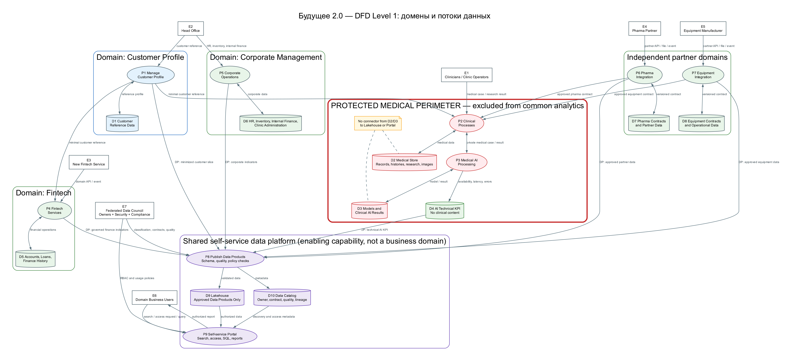

# Task2. Домены и потоки данных

## Артефакты

- [`dfd.png`](dfd.png) — Data Flow Diagram уровня 1.
- [`dfd.dot`](dfd.dot) — редактируемый источник DFD.

## Принципы разделения

1. Границы определяются бизнес-контекстом, а не текущими таблицами или приложениями.
2. За данные отвечает команда, наиболее близкая к соответствующему бизнес-процессу.
3. Между доменами передаются API, события и data products с версионируемыми контрактами, а не таблицы чужой БД.
4. Общая self-service-платформа предоставляет инфраструктуру, но не забирает у доменов семантическое владение.
5. Общие стандарты качества, метаданных, форматов и доступа задаются федеративно и автоматизируются.
6. Медицинские карты, истории болезни, снимки и результаты исследований не поступают в общую аналитическую витрину.

## Бизнес-домены

Конкретные должности владельцев являются предлагаемыми: в описании кейса нет организационной структуры ниже уровня подразделений.

| Домен | Владелец и ответственность | Операционные данные и контракты | Data products для общей аналитики |
|---|---|---|---|
| Клиентский профиль | Головной офис; руководитель клиентской экосистемы | Единый идентификатор и контактные/референсные сведения о клиенте; контракт `customer-reference` | Минимизированный или псевдонимизированный клиентский срез в пределах прав |
| Клиническая деятельность | Клиники; руководитель медицинского направления | Медкарты, истории болезни, исследования, снимки и лечение; защищённый `medical-case-for-ai` | **Не публикуются.** Медицинские данные не используются общей аналитикой |
| Медицинский ИИ | ИИ-компания; руководитель ИИ-продуктов | Модели, медицинские запросы и клинические результаты ИИ | Только технические KPI сервиса без идентификаторов и клинического содержания |
| Финтех | Компания с банковской лицензией; руководитель финтех-продуктов | Счета, кредиты, финансовая история и операции | Регламентированные финансовые показатели с RBAC, маскированием и финансовой сверкой |
| Корпоративное управление | Головной офис; руководитель корпоративных операций | Персонал, инвентаризация, внутренние финансы, управление клиниками | Кадровые, инвентаризационные, административные и финансово-отчётные продукты |
| Фармацевтические партнёры | Руководитель фармацевтических партнёрств | Партнёрские адаптеры, API, события и справочные данные | Только разрешённые партнёрские и операционные наборы по контракту |
| Медицинское оборудование | Руководитель партнёрств по оборудованию | Поставщики, устройства, сервисные события и схемы интеграций | Разрешённые справочные и операционные данные об оборудовании |

## Общая self-service-платформа

Это enabling capability, а не бизнес-домен. Её владелец — команда платформы данных.

Она предоставляет:

- оркестрацию публикации data products;
- Lakehouse-хранилище;
- проверки схем, качества и политик;
- каталог, владельцев, поиск и lineage;
- управление доступом;
- SQL-доступ и конструирование отчётов.

Отображение на инструменты практики курса:

- Airflow — оркестрация;
- S3/MinIO и Iceberg — хранение;
- Nessie — технический каталог и версии таблиц Iceberg;
- DataHub — домены, владельцы, бизнес-метаданные, поиск и lineage;
- Dremio — SQL и self-service.

Каждый публикуемый продукт содержит домен, владельца, описание, версионируемую схему, правила качества и freshness, классификацию, RBAC, источник и lineage.

## DFD уровня 1

В обозначениях DFD:

- прямоугольники — внешние сущности;
- овалы — процессы;
- цилиндры — хранилища;
- стрелки — именованные потоки данных;
- красная граница — защищённый медицинский контур.

## Основные потоки

| Поток | Бизнес-сценарий и результат |
|---|---|
| Врач/оператор → Clinical Process → Medical Store | Ведение клинического случая и результатов исследований внутри защищённого контура |
| Clinical Process → AI Process → Clinical Process | ИИ получает минимально необходимый медицинский контекст и возвращает результат только в клинику |
| Head Office → Customer Profile / Corporate Process | Ведение референсных клиентских и корпоративных данных |
| Новый финтех-сервис → Fintech Process | Новый сервис подключается внутри домена без изменения DWH |
| Фарма/Equipment Partner → соответствующий Partner Process | Партнёр подключается через версионируемый доменный контракт |
| Доменные процессы → Publish Data Products → Lakehouse | Домен самостоятельно поставляет только разрешённые данные с автоматическими проверками |
| Publish Data Products → Data Catalog | Регистрируются владелец, контракт, качество, классификация и lineage |
| Business User → Portal → Catalog/Lakehouse | Пользователь находит разрешённый продукт и строит отчёт в пределах доступа |
| Data Governance Council → Publish/Portal | Федеративные политики применяются одинаково ко всем доменам |

## Защита медицинских данных

- Medical Store доступен только клиническому и ИИ-доменам.
- Обмен между клиникой и ИИ проходит по приватному API с минимально необходимым набором данных.
- Клинический результат ИИ также считается медицинским и возвращается только в клинику.
- Для Medical Store не создаётся общий аналитический pipeline.
- Портал и общий каталог не показывают содержимое, профили и примеры медицинских данных.
- В общий Lakehouse допускаются только отдельно сформированные технические KPI ИИ без идентификаторов, диагнозов и результатов лечения.
- Финансовые данные могут входить в аналитику только при RBAC, маскировании, аудите и сверке.

## Независимость доменов

- У домена собственные команда, backlog, операционная модель и хранилище.
- Внутренняя схема может меняться независимо, пока соблюдается внешний контракт.
- Прямой SQL-доступ к БД другого домена запрещён.
- Операционный обмен идёт через API/события, аналитический — через data products.
- Контракты и схемы версионируются и проверяются в CI/CD.
- Платформа предоставляет шаблон публикации, но не становится новой централизованной командой DWH.

## Бизнес-выгоды

| Цель | Эффект |
|---|---|
| Быстрая отчётность | Запросы выполняются в масштабируемом Lakehouse, а не в перегруженном операционной логикой SQL Server |
| Снижение time-to-market | Доменные команды выпускают сервисы и data products без очереди на изменение центрального DWH |
| Независимый финтех | Новый сервис подключается к контрактам финтех-домена и не меняет другие направления |
| Независимый ИИ | ИИ-команда развивает модели отдельно, сохраняя защищённый интерфейс с клиникой |
| Новые бизнесы | Партнёр подключается через доменный адаптер и стандартный контракт |
| Целостные показатели | Портал объединяет разрешённые продукты через общие определения, не объединяя операционные БД |
| Доверие к данным | У каждого продукта есть владелец, качество, документация и lineage |
| Комплаенс | Медицинские данные не попадают в витрину, остальные чувствительные данные защищены политиками |

## Переход от текущего DWH

1. Логически распределить существующие таблицы/схемы по доменам и назначить владельцев.
2. Считать DWH временным legacy-источником, не добавляя туда новую междоменную логику.
3. Переносить операционные данные в доменные хранилища через snapshot/CDC и сверку.
4. Публиковать первые data products через общую платформу.
5. Переключать потребителей только после parallel run и контрольных проверок.
6. Оставлять временное legacy внутри конкретного домена, если оно ещё не прошло миграционный gate.
