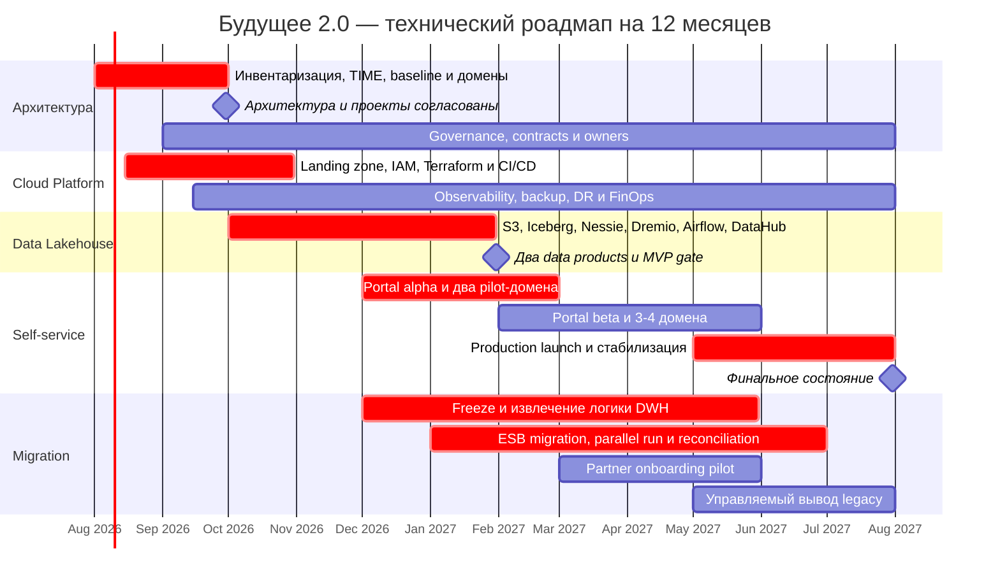

# Технический роадмап на 12 месяцев

## Ресурсная модель

| Команда | Плановая ёмкость |
|---|---:|
| Управление трансформацией | Program/Product Owner — 1; Enterprise Architect — 1; Data Architect — 1; Governance Lead — 1 |
| Cloud Platform / DevOps / SRE | 6–8 FTE на протяжении года |
| Data Platform | 7–9 FTE: lead, 3–4 data engineers, 2 platform/backend engineers, QA/data-quality, analyst |
| Security, privacy, compliance | 2–3 FTE плюс юридическая функция по запросу |
| BI и self-service enablement | 3–4 FTE с M4 |
| Доменная команда | 4–6 FTE на активный домен; одновременно подключаются не более двух доменов |
| Data owner | Один на приоритетный data product, занятость 20–40% |

Кроме людей нужны dev/test/prod-среды, объектное хранилище и backup, вычислительная ёмкость Dremio, закрытая связность с legacy, мониторинг, обучение и миграционный резерв. TCO уточняется после инвентаризации.

## Сводный план

| Этап | Срок | Бизнес-цель | Ключевой результат |
|---|---|---|---|
| 0. Согласование | M1–M2 | Получить промежуточное состояние из задания | Архитектура и домены согласованы, проекты заведены, baseline измерен |
| 1. Облачный фундамент | M1–M3 | Масштабирование и надёжность без ухудшения критичных сервисов | Landing zone, IAM, Terraform, CI/CD, audit, observability, backup/DR |
| 2. Lakehouse MVP | M3–M5 | Доказать быструю аналитику без расширения DWH | Два разрешённых data products от источника до SQL и каталога |
| 3. Portal alpha | M5–M7 | Первый self-service-сценарий и независимая публикация | 20+ pilot-пользователей, два домена публикуют продукты самостоятельно |
| 4. Масштабирование | M7–M10 | Ускорить новые направления и партнёров | 3–4 домена, партнёрский пилот, миграция приоритетных DWH/ESB-потоков |
| 5. Production | M10–M12 | Достичь финального состояния задания | Портал в production; legacy остаётся только в изолированных запланированных частях |

## Этап 0. Согласование трансформации — M1–M2

**Работы:** инвентаризация и TIME; C4/DFD и границы доменов; baseline времени отчётов, TTM, инцидентов и затрат; классификация; запрещённые медицинские атрибуты; ADR; портфель data products.

**Результат:** целевая архитектура согласована, границы и владельцы определены, в доменах созданы конкретные проекты.

**Ответственные:** CTO/sponsor, Program Owner, Enterprise/Data Architects, Security/Compliance, руководители доменов.

**Ресурсы:** 5–6 core FTE; руководители доменов по 20–30%.

**KPI:**

- 100% критичных систем классифицированы по TIME;
- 100% приоритетных наборов имеют класс и владельца;
- baseline производительности, TTM, инцидентов и затрат зафиксирован;
- архитектура и проекты согласованы до конца M2.

**Бизнес-обоснование:** предотвращает дорогую миграцию неправильных данных и заранее исключает нарушение медицинских ограничений.

## Этап 1. Безопасный облачный фундамент — M1–M3

**Работы:** landing zone; разделение сетей/папок/квот; SSO и IAM; KMS/secrets; dev/test/prod; Terraform и CI/CD; audit, observability, backup/restore, DR и FinOps.

**Результат:** воспроизводимая pilot-среда и шаблон подключения нового домена.

**Ответственные:** Platform/SRE, Security, Cloud Architect.

**Ресурсы:** 6–8 Platform/SRE, 2 Security, sandbox/pilot cloud capacity.

**KPI:**

- 100% pilot-инфраструктуры создаётся через Terraform;
- среда нового домена разворачивается не более чем за один рабочий день;
- 100% критичных backup-наборов проходят restore-тест;
- RPO/RTO утверждены владельцами критичных сервисов;
- нет открытых критических замечаний security review.

**Бизнес-обоснование:** снижает ручные ошибки и ускоряет подключение направлений, сохраняя проверяемое восстановление.

## Этап 2. MVP Data Lakehouse — M3–M5

**Работы:** S3, Iceberg, Nessie, Dremio, Airflow, DataHub; CDC из SQL Server; корпоративный и разрешённый финансовый pilot-product; contracts, lineage, quality и freshness SLO; автоматический запрет медицинских полей.

**Результат:** два data products проходят полный путь от источника до каталога и SQL-запроса.

**Ответственные:** Data Platform, два Data Owner, BI, Security.

**Ресурсы:** 7–9 Data Platform, 2 BI, 2 представителя доменов, 1 Security.

**KPI:**

- не менее двух опубликованных products;
- 100% pilot-products имеют owner, contract, lineage и SLO;
- quality checks успешны не менее чем для 99,5% записей;
- freshness SLO выполняется минимум в 95% запусков;
- p95 pilot-запросов минимум на 70% быстрее legacy-baseline;
- ноль запрещённых медицинских атрибутов в Lakehouse.

**Бизнес-обоснование:** даёт измеримый quick win и проверяет стек до крупных инвестиций.

## Этап 3. Portal alpha и два домена — M5–M7

**Работы:** SSO, поиск DataHub, запрос доступа, Dremio SQL/views, Power BI поверх curated data, обучение; два домена самостоятельно публикуют products; freeze новой логики в DWH; перенос первых расчётов.

**Результат:** alpha-портал используется ограниченной группой, два домена обновляют продукты без центральной команды DWH.

**Ответственные:** Portal/BI, Data Platform, два домена, Security.

**Ресурсы:** 5–6 Data Platform, 3 BI/UX, две доменные команды по 4–6 FTE, 1 Security/SRE.

**KPI:**

- 20+ активных pilot-пользователей;
- 70% pilot-отчётов создаются без доработки центральной платформенной командой;
- lead time нового pilot-отчёта снижен минимум на 50%;
- 100% запросов доступа проходят через RBAC и audit;
- ноль несанкционированных раскрытий;
- после M5 в DWH не добавляется новая бизнес-логика.

**Бизнес-обоснование:** подтверждает реальное снижение зависимости бизнеса от центральной IT-команды.

## Этап 4. Масштабирование Data Mesh — M7–M10

**Работы:** ещё 1–2 домена; шаблон product/domain onboarding; пилот фарм- или equipment-партнёра; перенос маршрутов Camel; извлечение логики DWH; parallel run, financial reconciliation, canary и rollback.

**Результат:** beta-портал, 3–4 домена, первый партнёрский сценарий и значимая часть приоритетных потоков вне DWH/ESB.

**Ответственные:** Domain Teams, Integration/API, Data Platform, SRE, Security/Compliance.

**Ресурсы:** 5 Data Platform, 2–3 доменные команды по 4–6 FTE, 3 Platform/SRE, 2 Security/Governance.

**KPI:**

- новый домен/партнёрский product подключается максимум за четыре недели;
- не менее 50% приоритетных ESB-маршрутов мигрировано;
- не менее 80% приоритетных products имеют owner, contract, lineage и quality SLO;
- финансовая сверка перенесённых потоков — 100%;
- ноль Sev-1 и ухудшений медицинских/финансовых SLO из-за миграции.

**Бизнес-обоснование:** ускоряет time-to-market новых бизнесов и снижает центральную связанность без потери корректности.

## Этап 5. Production и управляемый вывод legacy — M10–M12

**Работы:** production launch; обучение и support; миграция приоритетных отчётов; performance/cost tuning; security, DR и load tests; переключение сверенных потоков; вывод безопасных частей SQL Server, PowerBuilder и Camel.

**Результат:** портал работает в production; домены используют разрешённые products; legacy остаётся только там, где ещё не пройден cutover gate.

**Ответственные:** Portal Product, BI, Data Platform, SRE, Security, Support, Domain Owners.

**Ресурсы:** 5 Platform/Data, 3 BI/Support, 2–3 FTE миграции на домен, 2 Security/SRE.

**KPI:**

- 70%+ целевых пользователей активны ежемесячно;
- 60%+ приоритетных отчётов переведены;
- p95 приоритетного отчёта улучшен минимум на 70%;
- доступность портала не ниже 99,9%;
- 95% запусков приоритетных products выполняют freshness SLO;
- ноль утечек медицинских данных и Sev-1 из-за cutover;
- 100% критичных restore/cutover-сценариев протестировано;
- затраты не отклоняются от согласованного бюджета больше чем на 10%;
- стоимость поддержки legacy снижена минимум на 20% либо утверждён доказательный план дальнейшей экономии.

## Контрольные ворота

- **Gate 1, M2:** архитектура, домены, классификация, владельцы и проекты согласованы.
- **Gate 2, M5:** Lakehouse MVP прошёл performance, quality, security и restore checks.
- **Gate 3, M7:** alpha принят пользователями; подтверждено отсутствие запрещённых медицинских данных.
- **Gate 4, каждый critical cutover:** parallel run завершён, сверка успешна, rollback проверен, SLO не ухудшены.
- **Gate 5, M12:** портал запущен; legacy осталось только в изолированных частях с владельцем и планом.

## Mermaid Gantt

Даты условные и соответствуют двенадцати месяцам с августа 2026 по июль 2027.

