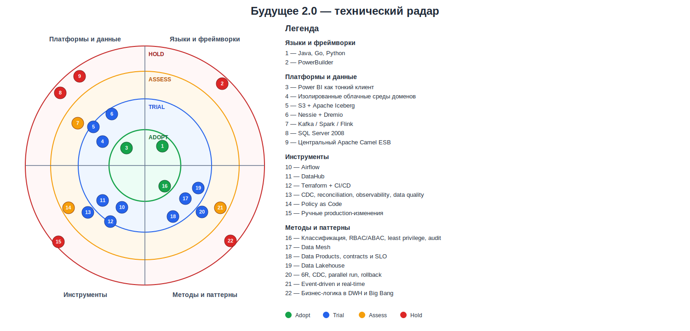

# Технический радар

## Кольца

- **Adopt** — проверенный стандарт, рекомендованный для широкого применения.
- **Trial** — ограниченное внедрение на реальном сценарии с критериями успеха.
- **Assess** — PoC или исследование; промышленное применение пока не разрешено.
- **Hold** — запрещено использовать в новых решениях; существующее применение мигрирует или выводится.

## Сводная матрица

| Квадрант | Adopt | Trial | Assess | Hold |
|---|---|---|---|---|
| Языки и фреймворки | Java, Go, Python | — | — | PowerBuilder |
| Платформы и данные | Power BI как тонкий BI-клиент | Изолированные облачные среды, S3, Iceberg, Nessie, Dremio | Kafka/streaming, Spark/Flink, active-active для аналитики | SQL Server 2008, новые связи через центральный Camel ESB |
| Инструменты | — | Airflow, DataHub, Terraform/CI/CD, CDC и сверка, observability/data quality | Policy as Code и автоматическая классификация | Ручные изменения production-инфраструктуры |
| Методы и паттерны | Классификация данных, least privilege, audit | Data Mesh, Data Products, Data Lakehouse, contracts/SLO, 6R, parallel run | Event-driven и real-time для подтверждённых сценариев | Бизнес-логика в DWH, прямые BI→DWH связи, Big Bang |

## Реестр технологий

| № | Квадрант | Технология/подход | Кольцо | Сценарии | Решение и обоснование |
|---:|---|---|---|---|---|
| 1 | Языки | Java, Go, Python | Adopt | BS-2, BS-3, BS-4 | Существующий поддерживаемый стек доменных и ИИ-сервисов. Используются актуальные версии; логика не переносится обратно в DWH |
| 2 | Языки | PowerBuilder | Hold | BS-2, BS-4, BS-5 | Новая функциональность запрещена; интерфейс переносится в доменные приложения, затем legacy выводится |
| 3 | Платформы | Power BI как тонкий клиент | Adopt | BS-1 | Сохраняются навыки пользователей, но источником становятся curated views Dremio, а не SQL Server 2008 |
| 4 | Платформы | Изолированные облачные среды доменов | Trial | BS-2–BS-6 | Пилот должен подтвердить сетевую изоляцию, IAM, квоты, стоимость и шаблон подключения домена |
| 5 | Платформы | S3 + Apache Iceberg | Trial | BS-1, BS-2, BS-5 | Масштабируемое хранение сотен ТБ, открытый формат, ACID, версии и эволюция схем |
| 6 | Платформы | Nessie + Dremio | Trial | BS-1, BS-4 | Технические версии Iceberg и SQL/self-service. Пилот измеряет производительность и разграничение доступа |
| 7 | Платформы | Kafka, Spark, Flink | Assess | BS-1–BS-4 | Не вводятся «на всякий случай»; переходят в Trial только при измеримой потребности в streaming/тяжёлой обработке |
| 8 | Платформы | SQL Server 2008 | Hold | BS-1, BS-2, BS-4, BS-5 | Запрет новых схем и логики; snapshot/CDC, перенос функций и последовательный вывод |
| 9 | Платформы | Центральный Apache Camel ESB | Hold | BS-2, BS-3, BS-4 | Новые маршруты запрещены; существующие переносятся на доменные API и события без Big Bang |
| 10 | Инструменты | Airflow | Trial | BS-1, BS-2 | Оркестрация загрузок, проверок и публикации data products |
| 11 | Инструменты | DataHub | Trial | BS-1, BS-2, BS-3, BS-6 | Каталог, владельцы, глоссарий, discovery и lineage; не является хранилищем данных |
| 12 | Инструменты | Terraform + CI/CD | Trial | BS-2, BS-4, BS-5 | Повторяемые среды, `plan` перед изменением и уменьшение ручных ошибок |
| 13 | Инструменты | CDC, reconciliation, observability и data-quality checks | Trial | BS-1, BS-4 | Непрерывная миграция и контроль свежести, полноты, корректности и SLO |
| 14 | Инструменты | Policy as Code | Assess | BS-6 | PoC автоматической проверки классификации, контрактов и инфраструктурных политик |
| 15 | Инструменты | Ручные изменения production | Hold | BS-4, BS-5 | Создают drift и неповторяемые окружения; изменения проходят через код и ревью |
| 16 | Методы | Классификация, RBAC/ABAC, least privilege и audit | Adopt | BS-4, BS-6 | Обязательный стандарт, включая запрет публикации медицинских данных |
| 17 | Методы | Data Mesh | Trial | BS-2, BS-3 | Проверяется на двух доменах; это изменение владения и процессов, а не обязательная замена всего IT-ландшафта |
| 18 | Методы | Data Products, contracts и SLO | Trial | BS-1–BS-4 | Владелец, схема, качество, актуальность, доступ и lineage для каждого продукта |
| 19 | Методы | Data Lakehouse | Trial | BS-1, BS-5 | Объединяет объектное хранение с управляемыми таблицами и аналитикой |
| 20 | Методы | 6R, CDC, parallel run и rollback | Trial | BS-4, BS-5 | Replatform инфраструктуры, Refactor логики DWH и Retire после проверенного переключения |
| 21 | Методы | Event-driven и real-time аналитика | Assess | BS-2, BS-3 | Применяется только для подтверждённого SLA задержки и бизнес-эффекта |
| 22 | Методы | Бизнес-логика в DWH и Big Bang | Hold | BS-1–BS-4 | Главные источники связанности и миграционного риска; новые реализации запрещены |

## Роли компонентов Lakehouse

- S3 хранит файлы данных.
- Iceberg определяет таблицы, схемы, версии и транзакции.
- Nessie хранит актуальное состояние технического каталога Iceberg.
- Airflow оркестрирует загрузку и проверки.
- Dremio выполняет SQL и предоставляет curated views.
- DataHub содержит корпоративные метаданные: домены, владельцев, glossary и lineage.

Nessie и DataHub не дублируют друг друга.

## Правила движения

- `Assess → Trial`: создан ADR, назначен владелец, есть бизнес-гипотеза, ограниченный use case и критерии окончания PoC.
- `Trial → Adopt`: минимум два успешных доменных внедрения, выполнены SLO производительности, качества, безопасности, восстановления и стоимости.
- `Hold`: запрещено новое использование, назначены владелец миграции, дата пересмотра и план вывода.
- Радар пересматривается ежеквартально, хранится как код и связывается с ADR и этапами роадмапа.

