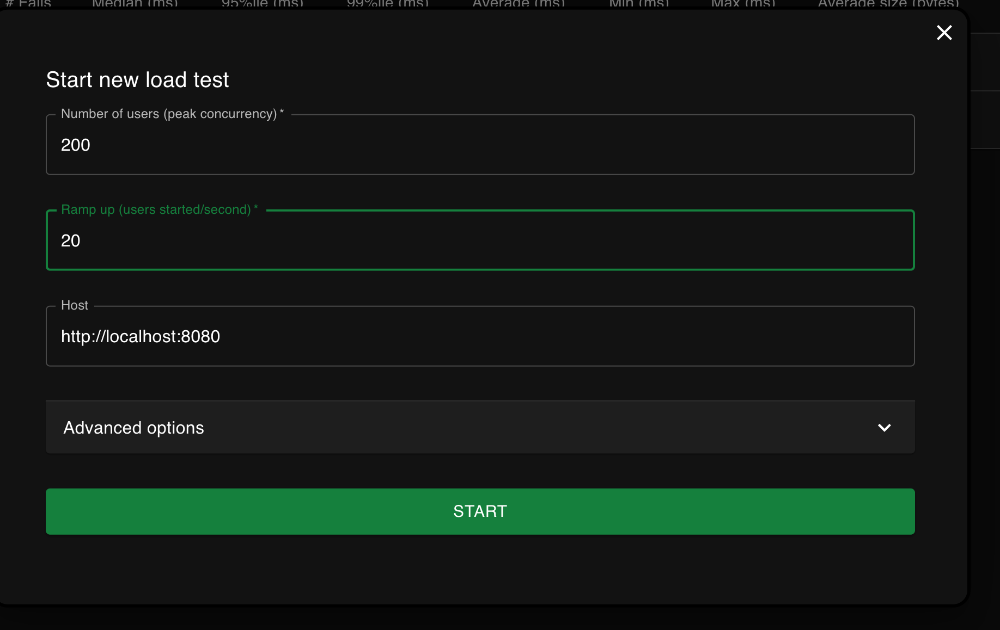
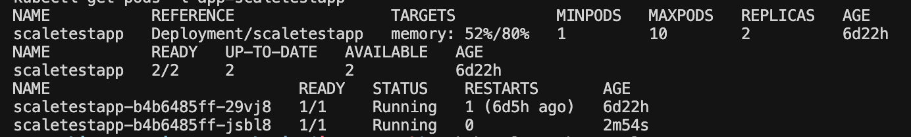

# Task2. Динамическое масштабирование контейнеров

## Что лежит в директории

- `deployment.yaml` - Deployment тестового приложения `scaletestapp` с одной начальной репликой и лимитом памяти `30Mi`.
- `service.yaml` - Service для доступа к приложению внутри кластера.
- `hpa.yaml` - HorizontalPodAutoscaler по утилизации памяти: целевое значение `80%`, максимум `10` реплик.
- `locustfile.py` - сценарий нагрузки для Locust.

## Как запустить локально

```bash
minikube start
minikube addons enable metrics-server
kubectl apply -f Task2/deployment.yaml
kubectl apply -f Task2/service.yaml
kubectl apply -f Task2/hpa.yaml
```

В `deployment.yaml` используется официальный образ `ghcr.io/yandex-practicum/scaletestapp:latest`, который указан в задании. На Apple Silicon/Mac с ARM64 этот образ может не скачаться с ошибкой `no matching manifest for linux/arm64/v8`. Если в `kubectl get pods` появился `ImagePullBackOff`, а в кластере уже есть рабочий локальный образ `scaletestapp:local`, можно откатить Deployment на него:

```bash
kubectl rollout undo deployment/scaletestapp
kubectl rollout status deployment/scaletestapp
```

Проверить, что приложение и HPA поднялись:

```bash
kubectl get pods
kubectl get hpa scaletestapp
kubectl describe hpa scaletestapp
```

Открыть доступ к приложению с локальной машины:

```bash
kubectl port-forward svc/scaletestapp 8080:8080
```

В соседнем терминале запустить Locust:

```bash
./Task2/run-locust.sh
```

После этого открыть UI Locust: `http://localhost:8089`.

Если нужно передать другой адрес приложения:

```bash
./Task2/run-locust.sh http://localhost:8080
```

Дополнительные параметры Locust можно передать после адреса. Например, короткий headless-запуск:

```bash
./Task2/run-locust.sh http://localhost:8080 --headless -u 10 -r 2 -t 1m
```


## Скрины работы

### Настройки нагрузочного теста в Locust

На скриншоте показаны параметры запуска теста в интерфейсе Locust: адрес тестируемого приложения, количество пользователей и скорость появления новых пользователей.



### Масштабирование приложения

На скриншоте видно, что Horizontal Pod Autoscaler изменил количество реплик приложения scaletestapp с 1 до 2: у Deployment статус 2/2, а в списке pod'ов отображаются два экземпляра приложения в состоянии Running.

