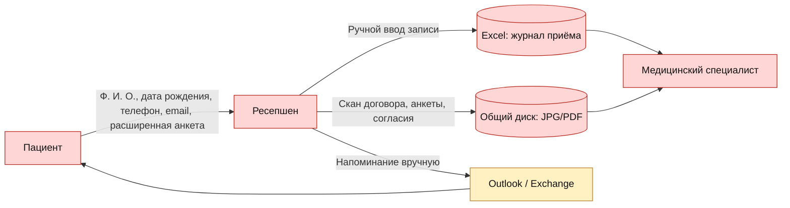
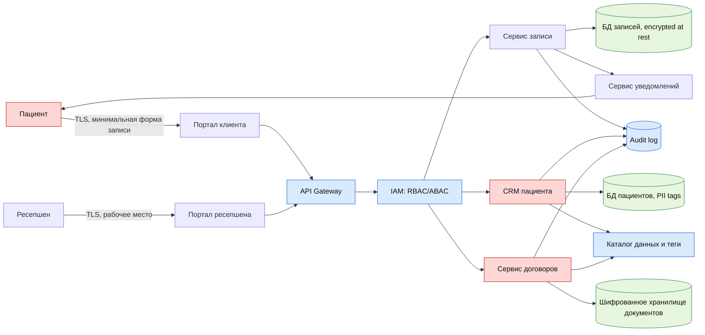
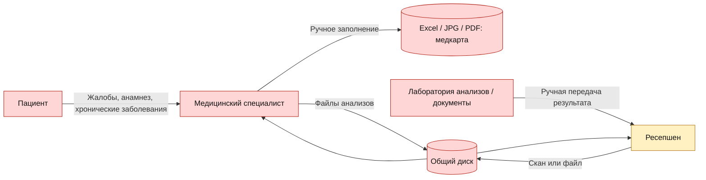
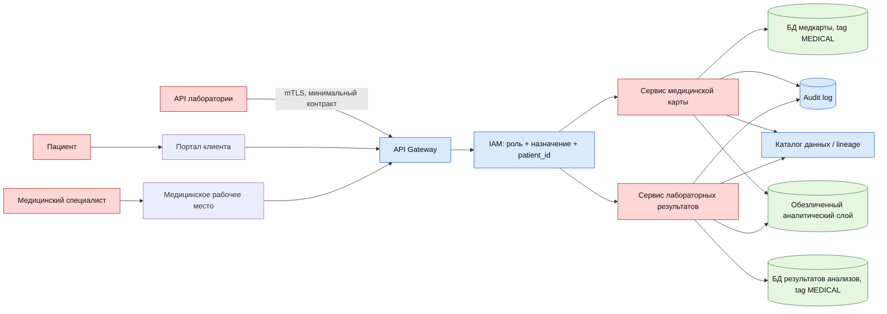
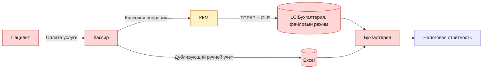
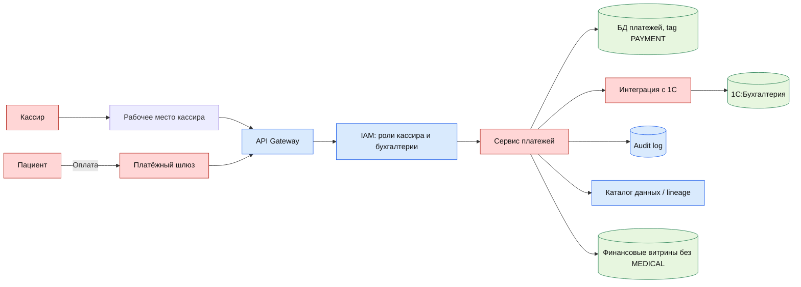
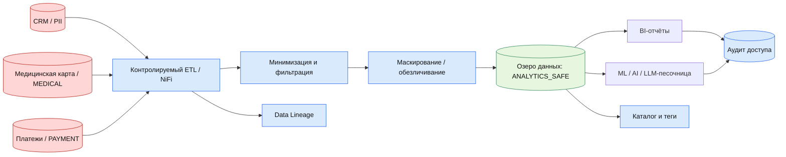

# Задание 1. Data Flow Diagrams

## Процесс 1. Запись пациента и договор, As-Is

Проблемы:

- PII и медицинские сведения попадают в Excel и сканы без классификации.
- Общий диск не разделяет доступ по роли и цели обработки.
- Нет аудита чтения, скачивания и изменения файлов.
- Расширенная анкета может собирать больше данных, чем нужно для записи.

## Процесс 1. Запись пациента и договор, To-Be

Добавленные меры:

- Privacy by default: форма записи собирает только минимальный набор данных.
- Теги: `PII`, `CONTRACT`, `RETENTION_LIMITED`.
- Доступ: ресепшен видит данные для записи и договора, но не полную медицинскую карту.
- Аудит: чтение и изменение чувствительных данных пишутся в журнал.
- Data Lineage: событие создания записи связывает пациента, источник и дальнейшие действия.

## Процесс 2. Медицинская карта и анализы, As-Is

Проблемы:

- Медицинские данные лежат в файловом виде без тегов и жизненного цикла.
- Нет гарантии, что врач видит только пациентов, с которыми работает.
- Нет контролируемой интеграции с лабораторией.
- Результаты анализов и заключения могут копироваться в неуправляемые файлы.

## Процесс 2. Медицинская карта и анализы, To-Be

Добавленные меры:

- API лаборатории не выдаёт и не принимает лишние категории данных.
- Доступ врача проверяется не только по роли, но и по связи с назначением пациента.
- В аналитику передаются обезличенные или агрегированные данные.
- По каждому результату анализа фиксируется источник, время получения и дальнейшие потребители.

## Процесс 3. Оплата и бухгалтерский учёт, As-Is

Проблемы:

- Двойной ручной учёт создаёт риск рассинхронизации.
- Платёжные данные связаны с пациентом, но не отделены от медицинских данных как отдельный домен.
- 1С работает в файловом режиме на локальном сервере.
- Нет единого аудита доступа к платежам и договорным данным.

## Процесс 3. Оплата и бухгалтерский учёт, To-Be

Добавленные меры:

- Платёжный домен отделён от медицинского домена.
- Кассир видит минимальные идентификаторы пациента, необходимые для оплаты.
- Бухгалтерия работает с платежами и налоговыми данными без доступа к медицинской карте.
- Отчёты строятся из контролируемых витрин, а не из ручных Excel-дублей.

## Процесс 4. BI, ML, AI и LLM, To-Be

Добавленные меры:

- Сырые PII и медицинские данные не передаются напрямую в BI/ML/AI.
- Перед аналитическим использованием применяются минимизация, маскирование и обезличивание.
- Для каждого набора фиксируются источник, трансформация и потребитель.
- Аналитик получает только наборы с тегом `ANALYTICS_SAFE`.
