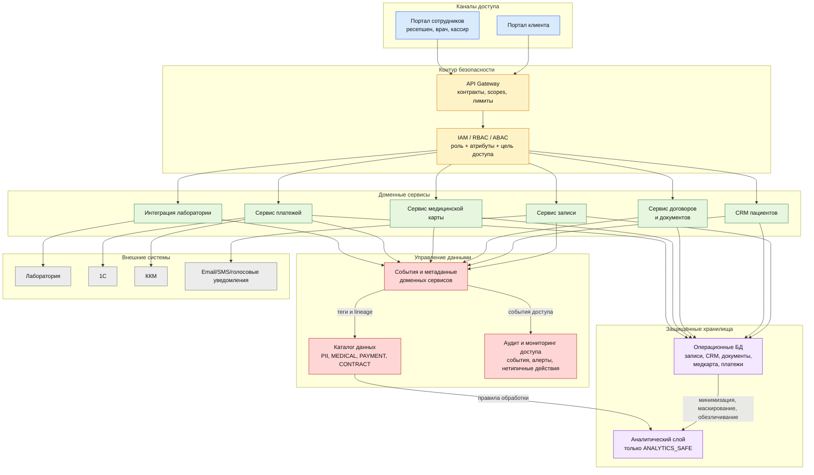

# Задание 2. Проектирование решения: C4 Context для MVP

## Цель MVP

MVP должен закрыть промежуточное состояние из задания: клиент самостоятельно записывается на приём через портал, ресепшен видит запись и может напомнить о приёме пациенту и специалисту. При этом архитектура сразу закладывает Privacy by Design:

- данные классифицируются по категориям и доменам;
- доступ определяется через RBAC/ABAC;
- API не отдаёт лишние категории данных;
- действия с чувствительными данными аудируются;
- аналитический слой получает только минимизированные и обезличенные данные.

## C4 Context

Диаграмма C4 Context находится в файле [c4-context.drawio](c4-context.drawio).

## Внутреннее разложение MVP

Детализация внутреннего устройства целевой системы из предыдущей диаграммы. Потоки идут сверху вниз: каналы доступа, контур безопасности, доменные сервисы, хранилища и контур управления данными.

## Новые блоки и связь с Privacy by Design

| Блок | Зачем нужен | Какой принцип закрывает |
| --- | --- | --- |
| API Gateway | Единая точка входа для портала, ресепшена, лаборатории и будущих партнёров | Конфиденциальность, встроенная в дизайн; прозрачность контрактов |
| IAM / RBAC / ABAC | Проверяет роль, атрибуты, цель доступа и связь пользователя с пациентом | Privacy by default; уважение к конфиденциальности пользователя |
| Каталог данных и тегирование | Классифицирует данные и даёт основу для политик доступа | Наглядность и прозрачность; Data Lineage |
| Аудит и мониторинг доступа | Фиксирует чтение, изменение, скачивание и нетипичные действия | End-to-end security; постоянный мониторинг |
| CRM пациентов | Золотой источник минимального профиля пациента | Data Minimization; целостность данных |
| Сервис медицинской карты | Изолирует самый чувствительный домен | Privacy embedded into design |
| Сервис договоров и документов | Убирает сканы с общего диска в управляемое хранилище | Полная защита жизненного цикла данных |
| Сервис платежей | Отделяет платёжные данные от медицинских | Полная функциональность без компромиссов |
| Сервис интеграции лаборатории | Позволяет строить внешние API без передачи лишних данных | Минимизация данных; безопасные потоки |
| Аналитический слой | Даёт BI/ML/AI без доступа к сырым PII и медицинским данным | Privacy by default; минимизация; обезличивание |

## Домены данных

| Домен | Золотой источник | Основные теги | Основные потребители |
| --- | --- | --- | --- |
| Записи на приём | Сервис записи | `PII`, `RETENTION_LIMITED` | Пациент, ресепшен, врач |
| Профиль пациента | CRM пациентов | `PII` | Ресепшен, врач, пациент |
| Медицинская карта | Сервис медицинской карты | `MEDICAL`, `PII` | Врач, пациент |
| Документы | Сервис договоров | `CONTRACT`, `PII` | Пациент, ресепшен, бухгалтерия |
| Платежи | Сервис платежей и 1С | `PAYMENT`, `PII` | Кассир, бухгалтерия |
| Аналитика | Аналитический слой | `ANALYTICS_SAFE` | Бизнес-аналитик, руководство |

## Требования к API лаборатории

1. Передавать только минимальный идентификатор назначения или заказа анализа, а не весь профиль пациента.
2. Использовать mTLS и проверку партнёра на API Gateway.
3. Разделить операции: создание заказа анализа, получение результата, подтверждение доставки результата.
4. Запретить доступ лаборатории к данным других пациентов и к данным, которые не нужны для анализа.
5. Все события обмена фиксировать в аудите и Data Lineage.

## Аналитический слой с учётом Privacy by Design

Аналитический слой не должен подключаться напрямую к операционным базам с сырыми персональными и медицинскими данными. Поток должен выглядеть так:

1. Операционные сервисы публикуют минимальные события или контролируемые выгрузки.
2. ETL/потоковый слой применяет правила минимизации.
3. PII и медицинские данные маскируются, обфусцируются или обезличиваются.
4. Наборы получают тег `ANALYTICS_SAFE`.
5. BI, ML, AI и LLM работают только с такими наборами.
6. Каталог хранит lineage: источник, трансформации, дата обновления, владелец и разрешённые потребители.
